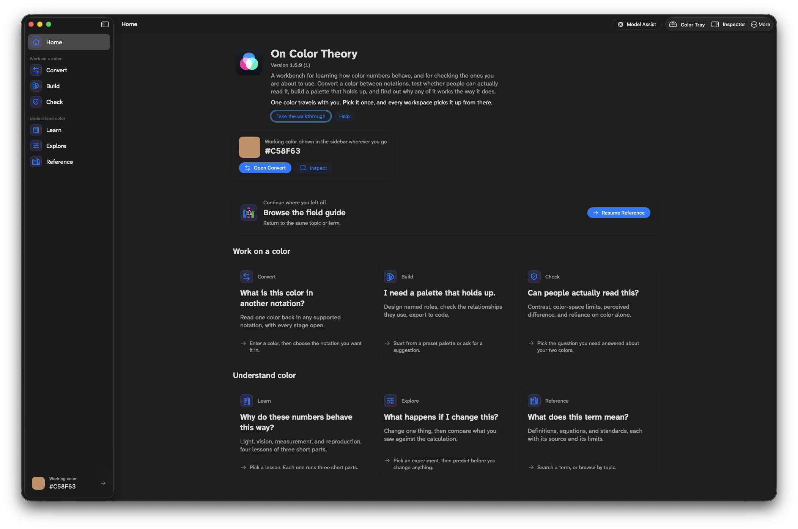

# On Color Theory

[](LICENSE.md)
[](#requirements)

[](https://github.com/drabhikroy/OnColorTheory/releases/latest)

On Color Theory is a workbench for exploring how color values behave and checking the ones you plan to use.

It is a native macOS application built with Swift and SwiftUI. Version 1.0.0 establishes the app shell, deterministic color core, Learn, Explore, Convert, Build, Check, and Reference workspaces, persistent Color Tray, Color Inspector, evidence metadata, and optional model-assisted palette recommendations.

No account and no telemetry. Nothing is sent anywhere unless you turn on
palette suggestions, which are off by default.



## What it does

On Color Theory is organized around one deterministic color core, exposed
through a Home dashboard, six workspaces, a persistent Color Tray, and a
Color Inspector. A saved session restores your last task across launches,
with a "Continue where you left off" card on Home.

- **Learn**: four numbered lessons, each built around one worked example:
  sRGB to linear light, WCAG contrast versus CIEDE2000 difference, how
  surrounding context shifts appearance, and mapping a Display P3 color
  into the sRGB gamut
- **Explore**: two hands-on experiments: mixing colors in encoded sRGB
  versus linear-light space, and source-over compositing for transparency
- **Convert**: moves a color between encoded sRGB, linear sRGB, Display
  P3, CIE XYZ (D65/D50), CIELAB/LCh, Oklab/OkLCh, and HSL, showing the
  calculation at each step, with code export to CSS, Swift, JavaScript,
  Python, R, and JSON
- **Build**: a role-based palette studio (canvas, text, accent, accent
  text) with light and dark starters, deterministic WCAG contrast checks,
  and an optional model-assisted suggestion (see
  [Local model](#local-model))
- **Check**: a diagnostic workbench for WCAG contrast, CIEDE2000 color
  difference (verified against the 34 Sharma, Wu, and Dalal reference
  pairs), a color-reliance review, and a Display P3-to-sRGB gamut check
- **Reference**: a searchable glossary of 24 color-science terms, each
  with its equation, a plain-language reading, and sources
- **Color Tray and Inspector**: a persistent, exportable record of every
  color you have worked with, plus a system screen sampler for picking a
  color from anywhere on screen

Interface cue palettes and other accessibility behavior are covered under
[Accessibility](#accessibility).

## What it does not do

The conversion path begins with sRGB's D65 white, then exposes a Bradford D65-to-D50 chromatic-adaptation step before reporting CSS CIELAB and CIE LCh. Oklab and OkLCh remain D65-relative. Both white points are visible wherever their coordinates appear.

RGB values outside 0 to 255, percentages outside 0% to 100%, and alpha outside 0 to 1 are reported as input errors instead of being silently clamped. That is deliberately stricter than browser processing so the learning tool does not hide a normalization step.

HSL is reported as a coordinate model over encoded sRGB; the app does not call its lightness perceptual lightness.

CIEDE2000 is reported as a relative modeled difference between two D50 CIELAB coordinates. The app does not label any single value as universally noticeable or acceptable because those judgments depend on viewing conditions, task, display behavior, surroundings, and observer.

The learning material treats WCAG contrast and CIEDE2000 as separate measures. A contrast ratio evaluates a specified foreground/background relationship for a named accessibility use; a color-difference value estimates relative separation in its stated model. The app does not infer one from the other.

The surroundings lesson holds the center pixels at the same encoded sRGB value while nearby neutral fields change. It demonstrates that context can influence appearance without assigning a universal magnitude or treating a color coordinate as a complete prediction of an individual observer. CIECAM16 is cited as a viewing-condition-specific color-appearance model, not used as a claim that this simplified display predicts every contextual effect.

The color-reliance check creates an equal-channel sRGB preview that preserves the pair's calculated relative luminances. This removes hue from a bounded visualization but is not a simulation of any color-vision deficiency. Whether color is the only cue remains a question about the complete design, its meaning, and its interaction states, so the app presents review prompts rather than an automatic pass or fail.

The gamut check accepts an opaque Display P3 color whose source components stay inside the Display P3 reference range. It converts through XYZ D65 using the current CSS Color 4 matrices and tests the resulting encoded sRGB channels against the sRGB 0 to 1 range. The clipped sRGB swatch is an intentionally simple comparison, not the CSS gamut-mapped result, a device measurement, or a recommendation for production color mapping.

The transparency experiment uses simple source-over compositing of encoded sRGB components over opaque backdrops. It deliberately does not stand in for a complete browser or display pipeline and does not cover blend modes, group opacity, high-dynamic-range rendering, or translucent backdrops.

## Planned

A **Brief History of Color** section and a **Color Theory** section will be added
in a later release. Neither ships in 1.0.0.

## Requirements

macOS 14 or newer, on Apple silicon.

Building from source additionally requires Xcode 26 or newer.

## Install

Download the latest `OnColorTheory-*.dmg` from the Releases page.

Open the DMG file and drag On Color Theory to your Applications folder, then
open it like any other application.

The application is signed with a Developer ID certificate and notarized by
Apple, so it opens with a plain double click and no security warning.

### Running from source

Open `Package.swift` in Xcode 26 or newer, select the `OnColorTheoryApp` scheme, and run it on macOS 14 or newer.

From Terminal:

```bash
swift run OnColorTheoryApp
```

## Local model

Ollama is not bundled and model recommendations are off by default. Choose the independently grouped **Model Assist** control in the main toolbar, or press Command-Option-O. The dedicated assistant explains the optional boundary, connection, installation, system-sized model choices, live download progress and cancellation, and exactly where to apply a suggestion:

- **Set up in On Color Theory** connects to Ollama on this Mac at `127.0.0.1:11434`; the assistant links to the official macOS installer, detects Ollama in Applications, recommends a conservative Qwen 3 starting size from the Mac's architecture and memory, and can discover, download, select, and delete models after Ollama is running. The assistant can also move the local Ollama app to the Trash after confirmation.
- **Use an external server** connects to an address supplied by the user and lists the models installed there. Remote hosts require HTTPS. HTTP remains available for localhost and private local-network addresses. The interface warns that the design brief and current palette are sent to that server.

Before generation, the Recommend stage can show the exact four-role design brief, current palette, destination, and excluded information. Local generation is labeled separately from sending a request to an external server. Requests are length-bounded, treat the design brief as untrusted data, and use Ollama's structured-output API. Returned values must be opaque `#RRGGBB` colors with bounded prose. The persistent interface preview supports an editable heading, body, cue heading, cue detail, and button label using the Studio, Light, Dark, or model-suggested palette. Custom preview copy remains available throughout all five Build stages. The model's text and colors remain a proposal; the deterministic app core independently calculates all displayed relationship results.

## Accessibility

- Six interface cue palettes: system accent, blue and orange, protan aware,
  deutan aware, tritan aware, and monochrome. None of them alters the
  scientific colors under analysis
- Every role carries a label, a symbol, or a position as well as a color, so
  meaning never rests on hue alone
- Responds to the system Differentiate Without Color, Reduce Transparency, and
  Reduce Motion settings
- Complete VoiceOver heading levels, at nine level one, thirty level two, and
  four level three
- Set in Atkinson Hyperlegible Next

Note that this application does not simulate color vision deficiency, and its
color reliance check is a luminance preserving preview rather than a
simulation. That limit is stated in What it does not do and is not softened
here.

## How it works

The implementation keeps three responsibilities separate:

1. Deterministic science and mathematics calculate.
2. A versioned evidence registry explains and cites.
3. Optional machine-learning providers propose.

`PaletteProposal` deliberately has no contrast, gamut, color-difference, or color-vision fields. It carries only the provider identity, the proposed colors, and the model's own summary. Those findings are produced separately by `InterfacePaletteEvaluator`, which returns `PaletteRelationshipResult` values calculated by the app rather than supplied by a model.

## For developers

### Documentation

- [Typography research](Documentation/TYPOGRAPHY_RESEARCH.md)
- [Evidence-based design decisions](Documentation/DESIGN_DECISIONS.md)
- [General-audience design framework baseline and open release gates](Documentation/DESIGN_FRAMEWORK_AUDIT.md)
- [Product audiences, contexts, misconceptions, and critical tasks](Documentation/PRODUCT_CONTEXT.md)
- [Release notes for 1.0.0](Documentation/RELEASE_NOTES_100.md)
- [1.0.0 validation record](Documentation/VALIDATION_100.md)
- [Security review](Documentation/SECURITY_REVIEW_100.md)
- [Third-party notices](THIRD_PARTY_NOTICES.md)

### Tests and standards gates

Run the automated checks:

```bash
swift test
```

### Building distributable packages

```bash
Scripts/build-app.sh release
```

The bundle is written to `Build/On Color Theory.app`, signed with a Developer ID Application certificate when one is available in Keychain Access, or ad-hoc for local development when it is not.

For a public release, `Scripts/package-release.sh --notarize` signs, notarizes, and staples the distributed DMG.

The app icon is generated from geometry rather than stored as artwork. `Scripts/build-icon.py` holds the three base colors and the plate dimensions, and writes the asset catalog, the brand PNG and SVG, and an icns from one source. Editing the six palette constants at the top of that script and running it again rebuilds every size.

## Releases

Numbered archives use `On Color Theory-###-vMAJOR.MINOR.PATCH.zip`. The zero-padded build number is also stored in the app bundle, so Finder ordering and the app's internal identity stay aligned.

## Credits and background

### About the name

*De Coloribus*, rendered in English as *On Colors*, comes down to us in the
Aristotelian corpus, and the name here nods to it alongside the ordinary sense
of color theory. Modern scholars agree the treatise is not Aristotle's own.
Attributions to Theophrastus and to Strato of Lampsacus have both been proposed
and both refuted, so it is conventionally cited as pseudo-Aristotle. The nod is
to the tradition, not a claim about who held the pen.

### Where this came from

Much of the material here began as teaching material. I built it for the color
portion of a data visualization course I taught as an assistant professor at
West Virginia University, and it accumulated over several semesters as
explanations, worked examples, and demonstrations that answered the questions
students actually asked. Collecting it into one app was a way to keep it in a
form I could still use, and to give it a shape that does not depend on being in
the room to explain it.

If any of it is useful to you, whether for teaching, for design work, or out of
plain curiosity about how color numbers behave, please take it and use it.

## License

[PolyForm Noncommercial License 1.0.0](LICENSE.md). The full text is also at
<https://polyformproject.org/licenses/noncommercial/1.0.0>.

Personal use, personal study, hobby projects, teaching, academic research, and
use by charitable, educational, nonprofit, public research, public health, and
government organizations are permitted. Commercial use is not permitted without
a separate license.

Required notice: Copyright 2026 Abhik Roy.
